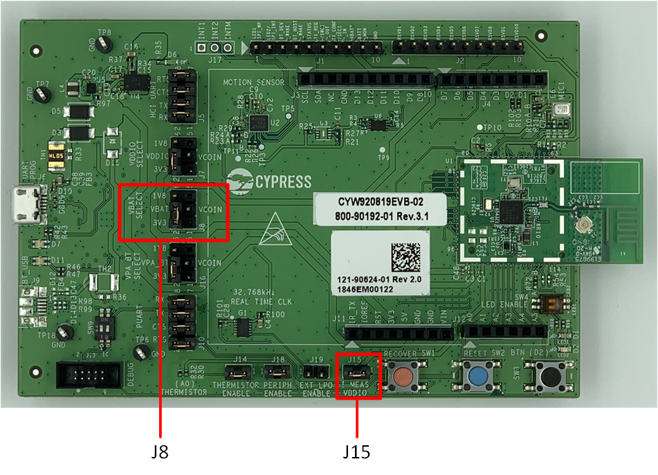
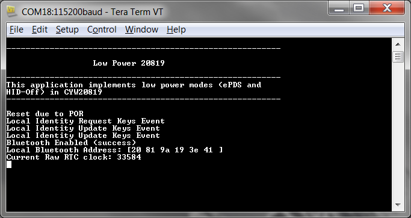
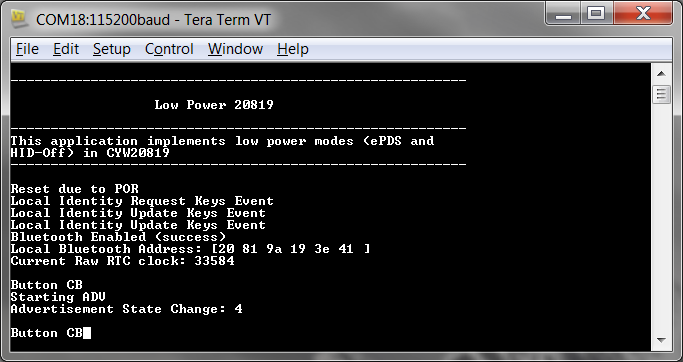
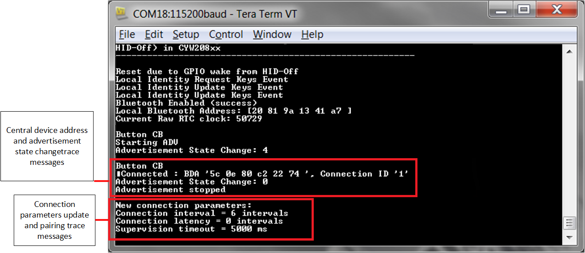
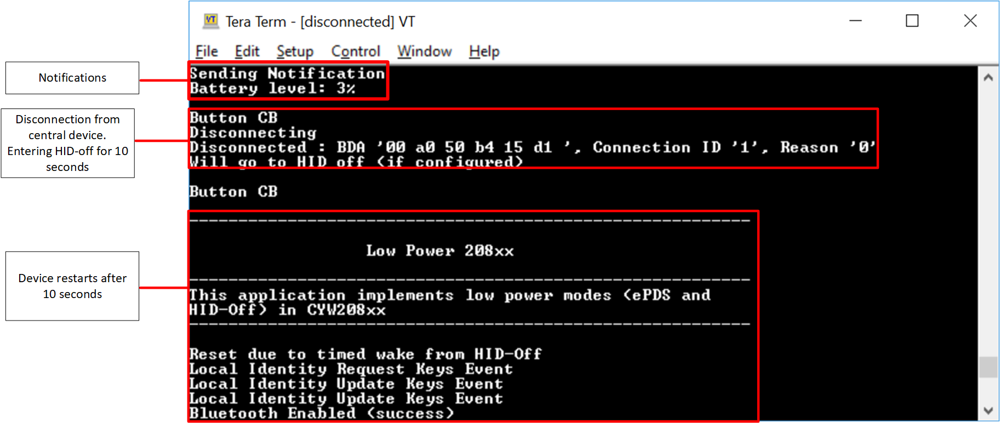
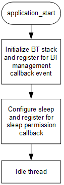

-------------------------------------------------------------------------------
## CYW208xx Low Power

This example demonstrates low power modes on CYW20819, CYW20820 and CYW89820 using ModusToolbox&#8482;.

### Requirements

[ModusToolbox&#8482;](https://www.infineon.com/cms/en/design-support/tools/sdk/modustoolbox-software/)

Programming Language: C

Associated Parts: [CYW20819](https://www.infineon.com/dgdl/Infineon-CYW20819_Ultra_Low_Power_Bluetooth_LE_BR_EDR_Bluetooth_5.0_SoC-AdditionalTechnicalInformation-v07_00-EN.pdf?fileId=8ac78c8c7d0d8da4017d0ee7dba070bf), [CYW20820](https://www.infineon.com/dgdl/Infineon-CYW20820_Ultra_Low_Power_Bluetooth_LE_BR_EDR_Bluetooth_5.0_SoC-AdditionalTechnicalInformation-v06_00-EN.pdf?fileId=8ac78c8c7d0d8da4017d0ee7e70770d1)

### Supported Kits
* [CYW920819EVB-02 Evaluation Kit](https://www.infineon.com/cms/en/product/evaluation-boards/cyw920819evb-02/)
* [CYW920820EVB-02 Evaluation kit]( https://www.infineon.com/cms/en/product/wireless-connectivity/airoc-bluetooth-le-bluetooth-multiprotocol/) 

Simply pick the supported kit in the IDE's New Application wizard. When you select a supported kit in the new application wizard the example is reconfigured automatically to work with the kit.

To work with a different supported kit, use the middleware selector to choose the BSP for the supported kit. You can also just start the process again and select a different kit.

If you want to use the application for a kit not listed here, you may need to update source files. If the kit does not have the required resources, the application may not work.

### Hardware Setup

*Boilerplate*

This example uses the kit’s default configuration. Refer to the kit guide to ensure the kit is configured correctly.

### Software Setup

This code example consists of two parts: a client and a server. For the client, download and install the CySmart app for [iOS](https://itunes.apple.com/us/app/cysmart/id928939093?mt=8) or [Android](https://play.google.com/store/apps/details?id=com.cypress.cysmart&hl=en). You can also use the [CySmart Host Emulation Tool](https://www.infineon.com/cms/en/design-support/tools/utilities/wireless-connectivity/cysmart-bluetooth-le-test-and-debug-tool/) Windows PC application if you have access to the [CY5677 CySmart LE 4.2 USB Dongle](https://www.infineon.com/cms/en/product/evaluation-boards/cy5677/).

Scan the following QR codes from your mobile phone to download the CySmart app.

This example uses a terminal emulator. Install one if you don't have one. The instructions use [Tera Term](https://ttssh2.osdn.jp/index.html.en).

This example requires no additional software or tools.

### Using the Code Example

If you are unfamiliar with this process, see [KBA225201](https://community.infineon.com/t5/Knowledge-Base-Articles/Importing-Code-Example-into-ModusToolbox-IDE-KBA225201/ta-p/250475) for all the details.

#### In the ModusToolbox&#8482; IDE

1. Click the **New Application** link in the Quick Panel (or, use **File > New > ModusToolbox&#8482; Application**).
2. Pick your kit. You must use a kit or device supported by the code example.  Some application settings (e.g. which pin controls an LED) may be adjusted automatically based on the kit you select.
3. In the **Starter Application** window, choose the example.
4. Click **Next** and complete the application creation process.

 If you are unfamiliar with this process, see [KBA225201](https://community.infineon.com/t5/Knowledge-Base-Articles/Importing-Code-Example-into-ModusToolbox-IDE-KBA225201/ta-p/250475) for all the details.

#### In Command Line Tools

Ensure that the development environment is set up correctly. See KBAnnnnn for details.

1. Download and unzip this repository onto your local machine, or clone the repository.
2. Open the Cygwin terminal and navigate to the application folder.
3. Import required libraries by executing the command **make getlibs**.

### Operation

1. Connect the kit to your PC using the provided USB cable through the USB connector.

2. If you want to measure power consumption, connect an ammeter across J15.1 and J15.2, and a second ammeter across J8.2 and J8.4 to measure current in VDDIO and VBAT domains respectively as shown in Figure 1. If you don't have 2 ammeters, then measure current on one domain at a time. Note that the VPA_BT power domain is not used on this kit and hence there is no need to measure current on this domain.

Figure 1. CYW920819EVB-02 Jumpers to measure Current

3. Remove jumpers J14 and J18 to disable unused peripherals on the evaluation kit.

4. The USB Serial interface on the kit provides access to the two UART interfaces of the CYW20819 device - "WICED HCI UART", and "WICED Peripheral UART" (PUART). The HCI UART is used only for downloading the application code in this code example and the PUART is used for printing the Bluetooth&#174; stack and application trace messages. Open your terminal software and select the PUART COM port, with a baud rate setting of 115200 bps. If you want to disable the trace messages, then comment out the following line in low_power_208xx.c:
*wiced_set_debug_uart( WICED_ROUTE_DEBUG_TO_PUART );*

5. Program the board.

   ##### Using the ModusToolbox&#8482; IDE

   1. Select the application project in the Project Exporer
   2. In the **Quick Panel**, scroll down, and click **\<App Name\> Program**.

   ##### Using CLI

   1. From the Cygwin terminal, execute the command **make build** to build the program for the default target. You can specify a tool chain as well (e.g. **make TOOLCHAIN=GCC_ARM** .)
   2. Execute command **make qprogram** to program the built application to the board.

**Note**: If the download fails, it is possible that a previously loaded application is preventing programming. For example, the application may use a custom baud rate that the download process does not detect or the device may be in low-power mode. In that case, it may be necessary to put the board in recovery mode, and then try the programming operation again from the IDE. To enter recovery mode, first, press and hold the Recover button (SW1), press and release the Reset button (SW2), and then release the Recover button (SW1).

6. After the programming is complete, the device will boot up and enter ePDS mode. Give the device a few seconds (~5) to enter ePDS mode. Note the current readings from ammeters. These are the current consumed in ePDS mode with no Bluetooth&#174; activity.

Figure 2. Bootup Log

7. Press switch SW3 on the evaluation kit. The application will get a button callback and it will start advertising. Note the current readings on the ammeters. This is the average current in ePDS mode with advertisement.

Figure 3. Start Advertisement Log

8. Do the following to test a connection using the CySmart mobile app:
    1. Turn ON Bluetooth&#174; on your Android or iOS device.
    2. Launch the CySmart app.
    3. Swipe down on the CySmart app home screen to start scanning for LE Peripherals; your device appears in the CySmart app home screen. Select your device to establish an LE connection. Once the device is connected, you can read the current numbers from the ammeters. These are the current in ePDS mode with a connection at a connection interval of 100 ms.
    4. Select the GATT DB from the carousel view.
    5. Select Battery Service and then select Characteristics.
    6. Select Notify. CYW920819EVB-02 will start sending GATT notifications to the mobile device. Note the current readings on the ammeters. These are the current in ePDS mode with a connection at a connection interval of 100 ms and notifications being sent every 5 seconds.
    7. Disconnect the Bluetooth&#174; connection by pressing SW3 on the kit or by backing out from the mobile app. The device will enter HID-Off mode for 10 seconds. Note the current numbers. These are the current numbers in HID-Off mode.

Figure 4. Connection, Pairing, and Connection Parameters Update Messages

Figure 5. Disconnection, HID-Off, and Restart Trace Messages

9. Do the following to test using the CySmart desktop application on a PC:
    1. Open the CySmart desktop application and connect to the CySmart CY5677 dongle (Central device). Refer to the CySmart User Guide on how to use this application.
    2. Scan and Connect to 'low_power_208xx' device. When asked for a connection parameter update, accept it. After the connection is established, you can measure the current values. These are the current numbers in ePDS mode with connection at 100 ms interval.
    3. Go to the device tab and click Discover all attributes.
    4. Click on Enable all Notifications. The device will start sending notifications every 5 seconds. Note the current readings on the ammeters. These are the current in ePDS mode with a connection at a connection interval of 100 ms and notifications being sent every 5 seconds.
    5. Click Disconnect to disconnect from the Central device. The device will enter HID-Off mode for 10 seconds. Note the current numbers. These are the current numbers in HID-Off mode.

### Design and Implementation

This code example implements a GATT Server and GAP Peripheral role on CYW920819EVB-02. Once the device is powered on, it boots up, configures sleep, initializes the Bluetooth&#174; stack, registers a button interrupt and GATT database, and then enters ePDS mode.
You need to press switch SW3 on the kit to start low-duty advertisement. The device is still in ePDS mode. You can now connect to the device using a GAP Central device. Upon connection, the device will request connection parameters to be updated (specifically, the connection interval to 100 ms). If the request is accepted, the connection interval changes to 100 ms. The device remains in ePDS mode and maintains the connection by sending empty packets. The GAP Central device can now discover all attributes and enable GATT notifications. The peripheral will start sending a dummy battery level value every 5 seconds.
The GATT Server implements a Battery Service with a Battery Level characteristic. This characteristic is readable and notifiable.
The application code and the Bluetooth&#174; stack runs on the Arm&#174 Cortex&#174-M4 core of the CYW20819 SoC. The application-level source files for this code example are listed in Table 1.

Table 1. Code Example File Structure
|**File Name**|**Comments**|
|-------------|------------|
|low_power_20819.c|Contains the application_start() function, which is the entry point for execution of the user application code after device startup. It also has the sleep callback function used by the PMU. The contents in this file can be referenced to implement low-power modes in other applications.|
|app_bt_cfg.c, app_bt_cfg.h|These files contain the runtime Bluetooth&#174; stack configuration parameters such as device name and advertisement/connection settings.|
|cycfg_bt.h, cycfg_gatt_db.c, cycfg_gatt_db.h|These files reside in the GeneratedSource folder under the application folder. They contain the GATT database information generated using the Bluetooth&#174; Configurator tool.|
|low_power_20819_ble.c|This file contains the Bluetooth&#174; events callback function along with other functions to service Bluetooth&#174; events. It also contains the button callback function.|

###Application Flow

The following diagrams show the flow of the application code.
    	Figure 6 shows the flow of the application when it boots up.
    	Figure 7 shows the flow of the button callback.
    	Figure 8 shows the flow of Bluetooth&#174; stack management event callbacks.
    	Figure 9 shows the flow of GATT event callbacks.
    	Figure 10 shows the tree of the functions that are called on the Bluetooth&#174; and GATT event callbacks from the stack.

Figure 6. Application Flow After Bootup

Figure 7. Button Callback Flow

Figure 8. Bluetooth&#174; Stack Management Callback Flow

Figure 9. GATT Event Callback Flow

Figure 10. Bluetooth&#174; Management and GATT Events Function Call Tree

###Current Measurements

The instantaneous current consumed by the device is not a steady-state value, but varies depending on the state of the chip that dynamically changes with power mode transitions, making it practically impossible to measure each individual instantaneous current with a handheld multimeter because the duration of these current bursts is very small.
Therefore, you should use a multimeter that provides the option to set the ”aperture” of the measurement. The aperture is the period ”T” during which the multimeter measures the instantaneous currents, integrates them, and then displays the average current for the period ”T”. For accurate measurements, the aperture of the multimeter should be set to be the same as the advertising or the connection interval. The following tables gives the current values for VBAT and VDDIO in various scenarios. Note that the current is averaged over 10 second intervals.

Table 2. CYW20819 Current in Different Modes

| State                                   | ePDS Enabled VDDIO | ePDS Enabled VBAT | ePDS Disabled VDDIO | ePDS Disabled VBAT |
|-----------------------------------------|--------------------|-------------------|---------------------|--------------------|
| No Bluetooth&#174; activity                   | 2.1 uA             | 7.7 uA            | 47.9 uA             | 0.97 mA            |
| ADV (2.56 seconds interval)             | 2.3 uA             | 26.1 uA           | 47.9 uA             | 0.98 uA            |
| Connection (100 ms connection interval) | 3.2 uA             | 147.2 uA          | 47.9 uA             | 1.02 mA            |
| Notifications (5 s interval)            | 3.3 uA             | 148.3 uA          | 47.9 uA             | 1.02 mA            |

Table 3. CYW20819 Current in HID-Off Mode

| State   | VDDIO  | VBAT   |
|---------|--------|--------|
| HID-Off | 2.2 uA | 0.7 uA |

Table 4. CYW20819 Current in Different Connection Intervals

| Connection Interval | ePDS Enabled VDDIO | ePDS Enabled VBAT | ePDS Disabled VDDIO | ePDS Disabled VBAT |
|---------------------|--------------------|-------------------|---------------------|--------------------|
| 7.5 ms | 14.5 uA | 1.49 mA | 47.9 uA | 1.58 mA |
| 10 ms | 11.3 uA | 1.16 mA | 47.9 uA | 1.43 mA |
| 11.25 ms | 10.2 uA | 1.03 mA | 47.9 uA | 1.38 mA |
| 12.5 ms | 9.4 uA | 0.89 mA | 47.9 uA | 1.34 mA |
| 13.75 ms | 9.9 uA | 0.96 mA | 47.9 uA | 1.31 mA |
| 15 ms | 9.4 uA | 0.89 mA | 47.9 uA | 1.28 mA |
| 25 ms | 6.6 uA | 0.54 mA | 47.9 uA | 1.17 mA |
| 50 | 4.4 uA | 0.27 mA | 47.9 uA | 1.08 mA |
| 100 | 3.2 uA | 0.14 mA | 47.9 uA | 1.03 mA |
| 500 | 2.31 uA | 0.04 mA | 47.9 uA | 0.98 mA |
| 1000 ms | 2.2 uA | 0.02 mA | 47.9 uA | 0.98 |
| 2000 ms | 2.2 uA | 0.02 mA | 47.9 uA | 0.98 mA |
| 4000 ms | 2.1 uA | 0.02 mA | 47.9 uA | 0.97 mA |

Table 5. CYW20820 Current in Different Modes

| State                                   | ePDS Enabled VDDIO | ePDS Enabled VBAT | ePDS Disabled VDDIO | ePDS Disabled VBAT |
|-----------------------------------------|--------------------|-------------------|---------------------|--------------------|
| No Bluetooth&#174; activity                   | 2.45 uA             | 6.21 uA            | 48.62 uA             | 0.98 mA            |
| ADV (2.56 seconds interval)             | 2.65 uA             | 20.65 uA           | 45.08 uA             | 0.99 uA            |
| Connection (100 ms connection interval) | 3.89 uA             | 137.8 uA          | 45.11 uA             | 1.02 mA            |
| Notifications (5 s interval)            | 4.15 uA             | 142.54 uA          | 45.23 uA             | 1.02 mA            |

Table 6. CYW20819 Current in HID-Off Mode

| State   | VDDIO  | VBAT   |
|---------|--------|--------|
| HID-Off | 2.2 uA | 0.7 uA |

Table 7. CYW20820 Current in Different Connection Intervals

| Connection Interval | ePDS Enabled VDDIO | ePDS Enabled VBAT | ePDS Disabled VDDIO | ePDS Disabled VBAT |
|---------------------|--------------------|-------------------|---------------------|--------------------|
| 7.5 ms | 21.31 uA | 1.71 mA | 45.22 uA | 1.56 mA |
| 10 ms | 16.5 uA | 1.3 mA | 45.23 uA | 1.42 mA |
| 11.25 ms | 14.95 uA | 1.16 mA | 45.23 uA | 1.37 mA |
| 12.5 ms | 13.69 uA | 1.05 mA | 45.2 uA | 1.37 mA |
| 13.75 ms | 11.88 uA | 0.92 mA | 45.19 uA | 1.29 mA |
| 15 ms | 11.23 uA | 0.85 mA | 45.19 uA | 1.27 mA |
| 25 ms | 7.89 uA | 0.51 mA | 445.2 uA | 1.15 mA |
| 50 | 5.28 uA | 0.26 mA | 45.19 uA | 1.07 mA |
| 100 | 3.93 uA | 0.13 mA | 45.14 uA | 1.02 mA |
| 500 | 2.8 uA | 0.035 mA | 45.21 uA | 0.99 mA |
| 1000 ms | 2.63 uA | 0.021 mA | 45.18 uA | 0.98 |
| 2000 ms | 2.61 uA | 0.017 mA | 45.16 uA | 0.98 mA |
| 4000 ms | 2.56 uA | 0.011 mA | 45.07 uA | 0.98 mA |

Note that these current values also include some leakage current on the board because some GPIOs connected to the on-board components draw current. For accurate current numbers, see the device datasheet.

####Resources and Settings
This example uses the default device configurator settings i.e., when this example is imported to ModusToolbox&#8482;, the IDE creates the file design.modus file that is used for design configuration with default settings for the kit. Note that in the design.modus file, the SPI and I2C modules are enabled, but because these are not used in the application, they will not cause any current leakage. It also provides the GATT database files so you don’t have to generate the files.

###Reusing This Example
This example is designed in a way so that you can use the low-power functions from this example in your own example with minimal changes.

### Related Resources

| Application Notes |  |
|------------------------------------------------------------------------------|---------------------------------------------------------------------------------------------|
| [AN225684 ](https://www.infineon.com/dgdl/Infineon-AN225684_Getting_Started_with_CYW20819-ApplicationNotes-v02_00-EN.PDF?fileId=8ac78c8c7cdc391c017d0d3674d1669d) – Getting Started with CYW20819 | Describes the CYW20819 device and demonstrates how to build your first ModusToolbox&#8482; project |

| Code Examples |
|--------------------------------------------------------------------------------------------------------------------------------------------|
| Visit the [Infineon GitHub](https://github.com/Infineon/Code-Examples-for-ModusToolbox-Software) repo for a comprehensive collection of code examples using ModusToolbox&#8482;|

| Development Kit Documentation |
|--------------------------------------------------------------------------------------------------------------------------------------------|
| [CYW20819EVB-02 Evaluation Kit](https://www.infineon.com/cms/en/product/evaluation-boards/cyw920819evb-02/) |

| Tools Documentation |  |
|------------------------------------------------------------------------------|---------------------------------------------------------------------------------------------|
| [ModusToolbox&#8482;](https://www.infineon.com/cms/en/design-support/tools/sdk/modustoolbox-software/)| The ModusToolbox&#8482; cross-platform IDE simplifies development for IoT designers. Look in <ModusToolbox install>/docs.|

#### Other Resources

Infineon provides a wealth of data at www.infineon.com to help you to select the right device, and quickly and effectively integrate the device into your design.

## BTSTACK version

BTSDK AIROC&#8482; chips contain the embedded AIROC&#8482; Bluetooth&#174; stack, BTSTACK. Different chips use different versions of BTSTACK, so some assets may contain variant sets of files targeting the different versions in COMPONENT\_btstack\_vX (where X is the stack version). Applications automatically include the appropriate folder using the COMPONENTS make variable mechanism, and all BSPs declare which stack version should be used in the BSP .mk file, with a declaration such as: 
> COMPONENTS+=btstack\_v1 
or: 
> COMPONENTS+=btstack\_v3

## Common application settings

Application settings below are common for all BTSDK applications and can be configured via the makefile of the application or passed in via the command line.

##### BT\_DEVICE\_ADDRESS
> Set the BDA (Bluetooth&#174; Device Address) for your device. The address is 6 bytes, for example, 20819A10FFEE. By default, the SDK will set a BDA for your device by combining the 7 hex digit device ID with the last 5 hex digits of the host PC MAC address.

##### UART
> Set to the UART port you want to use to download the application. For example 'COM6' on Windows or '/dev/ttyWICED\_HCI\_UART0' on Linux or '/dev/tty.usbserial-000154' on macOS. By default, the SDK will auto-detect the port.

##### ENABLE_DEBUG
> For HW debugging, configure ENABLE\_DEBUG=1. See the document [AIROC&#8482;-Hardware-Debugging](https://github.com/Infineon/btsdk-docs/blob/master/docs/BT-SDK/WICED-Hardware-Debugging.pdf) for more information. This setting configures GPIO for SWD. 
>
   - CYW920819EVB-02/CYW920820EVB-02: SWD signals are shared with D4 and D5, see SW9 in schematics.
   - CYBT-213043-MESH/CYBT-213043-EVAL/CYBT-253059-EVAL: SWD signals are routed to P12=SWDCK and P13=SWDIO. Use expansion connectors to connect VDD, GND, SWDCK, and SWDIO to your SWD Debugger probe.
   - CYBT-223058-EVAL/CYW920835M2EVB-01/CYBT-243053-EVAL/CYBLE-343072-EVAL-M2B/CYBLE-333074-EVAL-M2B/CYBLE-343072-MESH: SWD signals are routed to P02=SWDCK and P03=SWDIO. Use expansion connectors to connect VDD, GND, SWDCK, and SWDIO to your SWD Debugger probe.
   - CYBT-263065-EVAL/CYBT-273063-EVAL: SWD signals are routed to P02=SWDCK and P04=SWDIO. Use expansion connectors to connect VDD, GND, SWDCK, and SWDIO to your SWD Debugger probe.
   - CYBT-343026-EVAL/CYBT-353027-EVAL/CYBT-333047-EVAL: SWD signals are routed to P11=SWDCK and P15=SWDIO. Use expansion connectors to connect VDD, GND, SWDCK, and SWDIO to your SWD Debugger probe.
   - CYBT-343052-EVAL: SWD signals are routed to P02=SWDCK and P03=SWDIO. Use expansion connectors to connect VDD, GND, SWDCK, and SWDIO to your SWD Debugger probe.
   - CYBT-413055-EVAL/CYBT-413061-EVAL: SWD signals are routed to P16=SWDCK and P17=SWDIO. Use expansion connectors to connect VDD, GND, SWDCK, and SWDIO to your SWD Debugger probe.
   - CYW989820EVB-01: SWDCK (P02) is routed to the J13 DEBUG connector, but not SWDIO. Add a wire from J10 pin 3 (PUART CTS) to J13 pin 2 to connect GPIO P10 to SWDIO.
   - CYW920719B2Q40EVB-01: PUART RX/TX signals are shared with SWDCK and SWDIO. Remove RX and TX jumpers on J10 when using SWD. PUART and SWD cannot be used simultaneously on this board unless these pins are changed from the default configuration.
   - CYW920721M2EVK-02/CYW920721M2EVB-03: The default setup uses P03 for SWDIO and P05 for SWDCK. Check the position of SW15 if using JLink with the DEBUG connector.
   - CYW920706WCDEVAL: SWD debugging requires fly-wire connections. The default setup P15 (J22 pin 3 or J24 pin 1) for SWDIO and P11 (J23 pin 5
    or J22 pin 4) for SWDCK.
   - CYW920735Q60EVB-01: SWD hardware debugging supported. The default setup uses the J13 debug header, P3 (J13 pin 2) for SWDIO and P2 (J13 pin 4) for SWDCK.  They can be optionally routed to D4 and D4 on the Arduino header J4, see SW9 in schematics.
   - CYW920736M2EVB-01: SWD hardware debugging requires fly-wire connections. The only option is using P14 for SWDCK and P15 for SWDIO. These route to Arduino header J2, A1 and A0. These can be fly-wired to Arduino header J4, D4 and D5. From there the signals connect to the KitProg3 SWD bridge. In addition, the debug macros (SETUP\_APP\_FOR\_DEBUG\_IF\_DEBUG\_ENABLED and BUSY\_WAIT\_TILL\_MANUAL\_CONTINUE\_IF\_DEBUG\_ENABLED) are placed in sparinit.c in code common to all applications for this device. Most applications for this device call bleprofile\_GPIOInit() in subsequent code, overwriting the SWD pin configuration. To use hardware debugging after the call to bleprofile\_GPIOInit(), place the debug macros in code after that call.
   - CYW943012B2EVK-01: SWD signals are shared with D4 and D5.
   - CYW920820M2EVB-01: The default setup uses P03 for SWDIO and P02 for SWDCK. Check the position of SW15 if using JLink with the DEBUG connector.
   - SWD hardware debugging is not supported on the following:
   >- CYW920721M2EVK-01
   >- CYW920835REF-RCU-01
   >- CYW920819REF-KB-01
   >- CYW9M2BASE-43012BT
   >- CYBT-423054-EVAL
   >- CYBT-423060-EVAL
   >- CYBT-483056-EVAL
   >- CYBT-483062-EVAL
   >- CYW955572BTEVK-01

## Building code examples

**Using the ModusToolbox&#8482; Eclipse IDE**

1. Install ModusToolbox&#8482; 2.2 (or higher).
2. In the ModusToolbox&#8482; Eclipse IDE, click the **New Application** link in the Quick Panel (or, use **File > New > ModusToolbox IDE Application**).
3. Pick your board for BTSDK under AIROC&#8482; Bluetooth&#174; BSPs.
4. Select the application in the IDE.
5. In the Quick Panel, select **Build** to build the application.
6. To program the board (download the application), select **Program** in the Launches section of the Quick Panel.

**Using command line**

1. Install ModusToolbox&#8482; 2.2 (or higher).
2. On Windows, use Cygwin from \ModusToolbox\tools_2.x\modus-shell\Cygwin.bat to build apps.
3. Use the tool 'project-creator-cli' under \ModusToolbox\tools_2.x\project-creator\ to create your application. 
   > project-creator-cli --board-id (BSP) --app-id (appid) -d (dir)  
   See 'project-creator-cli --help' for useful options to list all available BSPs, and all available apps per BSP. 
   For example: 
   > project-creator-cli --app-id mtb-example-btsdk-empty --board-id CYW920706WCDEVAL -d . 
4. To build the app call make build. For example: 
   > cd mtb-examples-btsdk-empty 
   > make build 
5. To program (download to) the board, call: 
   > make qprogram 
6. To build and program (download to) the board, call: 
   > make program  
   Note: make program = make build + make qprogram

## Downloading an application to a board

If you have issues downloading to the board, follow the steps below:

- Press and hold the 'Recover' button on the board.
- Press and hold the 'Reset' button on the board.
- Release the 'Reset' button.
- After one second, release the 'Recover' button.

Note: this is only applicable to boards that download application images to FLASH storage. Boards that only support RAM download (DIRECT_LOAD) such as CYW9M2BASE-43012BT can be power cycled to boot from ROM.

## Over The Air (OTA) Firmware Upgrade
Applications that support OTA upgrade can be updated via the peer OTA app in: 
>\<Workspace Dir>\mtb\_shared\wiced\_btsdk\tools\btsdk-peer-apps-ota 

See the readme.txt file located in the above folder for instructions. 
To generate the OTA image for the app, configure OTA\_FW\_UPGRADE=1 in the app
makefile, or append OTA\_FW\_UPGRADE=1 to a build command line, for example:
> make PLATFORM=CYW920706WCDEVAL OTA\_FW\_UPGRADE=1 build 

This will the generate \<app>.bin file in the 'build' folder.

## SDK software features

- Dual-mode Bluetooth&#174; stack included in the ROM (BR/EDR and LE)
- Bluetooth&#174; stack and profile level APIs for embedded Bluetooth&#174; application development
- AIROC&#8482; HCI protocol to simplify host/MCU application development
- APIs and drivers to access on-board peripherals
- Bluetooth&#174; protocols include GAP, GATT, SMP, RFCOMM, SDP, AVDT/AVCT, LE Mesh
- LE and BR/EDR profile APIs, libraries, and sample apps
- Support for Over-The-Air (OTA) upgrade
- Device Configurator for creating custom pin mapping
- Bluetooth&#174; Configurator for creating LE GATT Database
- Peer apps based on Android, iOS, Windows, etc. for testing and reference
- Utilities for protocol tracing, manufacturing testing, etc.
- Documentation for APIs, datasheets, profiles, and features
- BR/EDR profiles: A2DP, AVRCP, HFP, HSP, HID, SPP, MAP, PBAP, OPP
- LE profiles: Mesh profiles, HOGP, ANP, BAP, HRP, FMP, IAS, ESP, LE COC
- Apple support: Apple Media Service (AMS), Apple Notification Center Service (ANCS), iBeacon, Homekit, iAP2
- Google support: Google Fast Pair Service (GFPS), Eddystone
- Amazon support: Alexa Mobile Accessories (AMA)

Note: this is a list of all features and profiles supported in BTSDK, but some AIROC&#8482; devices may only support a subset of this list.

## List of boards available for use with BTSDK

- [CYW20819A1 chip](https://github.com/Infineon/20819A1)
    - [CYW920819EVB-02](https://github.com/Infineon/TARGET_CYW920819EVB-02), [CYBT-213043-MESH](https://github.com/infineon/TARGET_CYBT-213043-MESH), [CYBT-213043-EVAL](https://github.com/infineon/TARGET_CYBT-213043-EVAL), [CYW920819REF-KB-01](https://github.com/infineon/TARGET_CYW920819REF-KB-01), [CYBT-223058-EVAL](https://github.com/infineon/TARGET_CYBT-223058-EVAL), [CYBT-263065-EVAL](https://github.com/infineon/TARGET_CYBT-263065-EVAL), [CYBT-273063-EVAL](https://github.com/infineon/TARGET_CYBT-273063-EVAL)
- [CYW20820A1 chip](https://github.com/infineon/20820A1)
    - [CYW920820EVB-02](https://github.com/infineon/TARGET_CYW920820EVB-02), [CYW989820EVB-01](https://github.com/infineon/TARGET_CYW989820EVB-01), [CYBT-243053-EVAL](https://github.com/infineon/TARGET_CYBT-243053-EVAL), [CYBT-253059-EVAL](https://github.com/infineon/TARGET_CYBT-253059-EVAL), [CYW920820M2EVB-01](https://github.com/Infineon/TARGET_CYW920820M2EVB-01)
- [CYW20721B2 chip](https://github.com/infineon/20721B2)
    - [CYW920721M2EVK-01](https://github.com/infineon/TARGET_CYW920721M2EVK-01), [CYW920721M2EVK-02](https://github.com/infineon/TARGET_CYW920721M2EVK-02), [CYW920721M2EVB-03](https://github.com/Infineon/TARGET_CYW920721M2EVB-03), [CYBT-423060-EVAL](https://github.com/infineon/TARGET_CYBT-423060-EVAL), [CYBT-483062-EVAL](https://github.com/infineon/TARGET_CYBT-483062-EVAL), [CYBT-413061-EVAL](https://github.com/infineon/TARGET_CYBT-413061-EVAL)
- [CYW20719B2 chip](https://github.com/infineon/20719B2)
    - [CYW920719B2Q40EVB-01](https://github.com/infineon/TARGET_CYW920719B2Q40EVB-01), [CYBT-423054-EVAL](https://github.com/infineon/TARGET_CYBT-423054-EVAL), [CYBT-413055-EVAL](https://github.com/infineon/TARGET_CYBT-413055-EVAL), [CYBT-483056-EVAL](https://github.com/infineon/TARGET_CYBT-483056-EVAL)
- [CYW20706A2 chip](https://github.com/infineon/20706A2)
    - [CYW920706WCDEVAL](https://github.com/infineon/TARGET_CYW920706WCDEVAL), [CYBT-353027-EVAL](https://github.com/infineon/TARGET_CYBT-353027-EVAL), [CYBT-343026-EVAL](https://github.com/infineon/TARGET_CYBT-343026-EVAL), [CYBT-333047-EVAL](https://github.com/Infineon/TARGET_CYBT-333047-EVAL)
- [CYW20735B1 chip](https://github.com/infineon/20735B1)
    - [CYW920735Q60EVB-01](https://github.com/infineon/TARGET_CYW920735Q60EVB-01), [CYBT-343052-EVAL](https://github.com/infineon/TARGET_CYBT-343052-EVAL)
- [CYW20835B1 chip](https://github.com/infineon/20835B1)
    - [CYW920835REF-RCU-01](https://github.com/infineon/TARGET_CYW920835REF-RCU-01), [CYW920835M2EVB-01](https://github.com/infineon/TARGET_CYW920835M2EVB-01), [CYBLE-343072-EVAL-M2B](https://github.com/Infineon/TARGET_CYBLE-343072-EVAL-M2B), [CYBLE-333074-EVAL-M2B](https://github.com/Infineon/TARGET_CYBLE-333074-EVAL-M2B), [CYBLE-343072-MESH](https://github.com/Infineon/TARGET_CYBLE-343072-MESH)
- [CYW43012C0 chip](https://github.com/infineon/43012C0)
    - [CYW9M2BASE-43012BT](https://github.com/Infineon/TARGET_CYW9M2BASE-43012BT), [CYW943012BTEVK-01](https://github.com/Infineon/TARGET_CYW943012BTEVK-01)
- [CYW20736A1 chip](https://github.com/Infineon/20736A1)
    - [CYW920736M2EVB-01](https://github.com/Infineon/TARGET_CYW920736M2EVB-01)
- [CYW30739A0 chip](https://github.com/Infineon/30739A0)
    - [CYW930739M2EVB-01](https://github.com/Infineon/TARGET_CYW930739M2EVB-01)
- [CYW55572A1 chip](https://github.com/Infineon/55572A1)
    - [CYW955572BTEVK-01](https://github.com/Infineon/TARGET_CYW955572BTEVK-01)

## Folder structure

All BTSDK code examples need the 'mtb\_shared\wiced\_btsdk' folder to build and test the apps. 'wiced\_btsdk' includes the 'dev-kit' and 'tools' folders. The contents of the 'wiced\_btsdk' folder will be automatically populated incrementally as needed by the application being used.

**dev-kit**

This folder contains the files that are needed to build the embedded Bluetooth&#174; apps.

* baselib: Files for chips supported by BTSDK. For example CYW20819, CYW20719, CYW20706, etc.

* bsp: Files for BSPs (platforms) supported by BTSDK. For example CYW920819EVB-02, CYW920706WCDEVAL etc.

* btsdk-include: Common header files needed by all apps and libraries.

* btsdk-tools: Build tools needed by BTSDK.

* libraries: Profile libraries used by BTSDK apps such as audio, LE, HID, etc.

**tools**

This folder contains tools and utilities need to test the embedded Bluetooth&#174; apps.

* btsdk-host-apps-bt-ble: Host apps (Client Control) for LE and BR/EDR embedded apps, demonstrates the use of AIROC&#8482; HCI protocol to control embedded apps.

* btsdk-host-peer-apps-mesh: Host apps (Client Control) and Peer apps for embedded Mesh apps, demonstrates the use of AIROC&#8482; HCI protocol to control embedded apps, and configuration and provisioning from peer devices.

* btsdk-peer-apps-ble: Peer apps for embedded LE apps.

* btsdk-peer-apps-ota: Peer apps for embedded apps that support Over The Air Firmware Upgrade.

* btsdk-utils: Utilities used in BTSDK such as BTSpy, wmbt, and ecdsa256.

See README.md in the sub-folders for more information.

## Software Tools
The following tool applications are installed on your computer either with ModusToolbox&#8482;, or by creating an application in the workspace that can use the tool.

**BTSpy:** 
>   BTSpy is a trace viewer utility that can be used with AIROC&#8482; Bluetooth&#174; platforms to
    view protocol and application trace messages from the embedded device. The
    utility is located in the folder below. For more information, see readme.txt in the same folder. 
    This utility can be run directly from the filesystem, or it can be run from
    the Tools section of the ModusToolbox&#8482; QuickPanel, or by right-clicking
    a project in the Project Explorer pane and selecting the ModusToolbox&#8482;
    context menu. 
    It is supported on Windows, Linux and macOS. 
    Location:  \<Workspace Dir>\wiced_btsdk\tools\btsdk-utils\BTSpy

**Bluetooth&#174; Classic and LE Profile Client Control:** 
>   This application emulates host MCU applications for LE and BR/EDR profiles.
    It demonstrates AIROC&#8482; Bluetooth&#174; APIs. The application communicates with embedded
    apps over the "WICED HCI UART" interface. The application is located in the folder
    below. For more information, see readme.txt in the same folder. 
    This utility can be run directly from the filesystem, or it can be run from
    the Tools section of the ModusToolbox&#8482; QuickPanel, or by right-clicking
    a project in the Project Explorer pane and selecting the ModusToolbox&#8482;
    context menu. 
    It is supported on Windows, Linux, and macOS. 
    Location:  \<Workspace Dir>\wiced\_btsdk\tools\btsdk-host-apps-bt-ble\client_control

**LE Mesh Client Control:** 
>   Similar to the above app, this application emulates host MCU applications
    for LE Mesh models. It can configure and provision mesh devices and create
    mesh networks. The application is located in the folder below. For more
    information, see readme.txt in the same folder. 
    This utility can be run directly from the filesystem, or it can be run from
    the Tools section of the ModusToolbox&#8482; QuickPanel (if a mesh-capable
    project is selected in the Project Explorer pane), or by right-clicking
    a mesh-capable project in the Project Explorer pane and selecting the
    ModusToolbox&#8482; context menu. 
    The full version is provided for Windows (VS\_ClientControl) supporting all
    Mesh models. 
    A limited version supporting only the Lighting model (QT\_ClientControl) is
    provided for Windows, Linux, and macOS. 
    Location:  \<Workspace Dir>\wiced_btsdk\tools\btsdk-host-peer-apps-mesh\host

**Peer apps:** 
>   Applications that run on Windows, iOS or Android and act as peer Bluetooth&#174; apps to
    demonstrate specific profiles or features, communicating with embedded apps
    over the air. 
    LE apps location:  \<Workspace Dir>\wiced\_btsdk\tools\btsdk-peer-apps-ble 
    LE Mesh apps location:  \<Workspace Dir>\wiced\_btsdk\tools\btsdk-host-peer-apps-mesh\peer 
    OTA apps location:  \<Workspace Dir>\wiced\_btsdk\tools\btsdk-peer-apps-ota

**Device Configurator:** 
>   Use this GUI tool to create source code for a custom pin mapping for your device. Run this tool
    from the Tools section of the ModusToolbox&#8482; QuickPanel, or by
    right-clicking a project in the Project Explorer pane and selecting the
    ModusToolbox&#8482; context menu. 
    It is supported on Windows, Linux and macOS. 
    Note: The pin mapping is based on wiced\_platform.h for your board. 
    Location:  \<Install Dir>\tools_2.x\device-configurator

**Bluetooth&#174; Configurator:** 
>   Use this GUI tool to create and configure the LE GATT Database and the BR/EDR SDP Database, generated as source code for your
    application. 
    Run this tool from the Tools section of the ModusToolbox&#8482; QuickPanel, or
    by right-clicking a project in the Project Explorer pane and selecting
    the ModusToolbox&#8482; context menu. 
    It is supported on Windows, Linux and macOS. 
    Location:  \<Install Dir>\tools_2.x\bt-configurator

## Tracing
To view application traces, there are 2 methods available. Note that the
application needs to configure the tracing options. 

1. "WICED Peripheral UART" - Open this port on your computer using a serial port
utility such as Tera Term or PuTTY (usually using 115200 baud rate for non-Mesh apps, and 921600 for Mesh apps). 
2. "WICED HCI UART" - Open this port on your computer using the Client Control
application mentioned above (usually using 3M baud rate). Then run the BTSpy
utility mentioned above.

## Using BSPs (platforms)

BTSDK BSPs are located in the \mtb\_shared\wiced\_btsdk\dev-kit\bsp\ folder by default.

#### a. Selecting an alternative BSP

The application makefile has a default BSP. See "TARGET". The makefile also has a list of other BSPs supported by the application. See "SUPPORTED_TARGETS". To select an alternative BSP, use Library Manager from the Quick Panel to deselect the current BSP and select an alternate BSP. Then right-click the newly selected BSP and choose 'Set Active'.  This will automatically update TARGET in the application makefile.

#### b. Custom BSP

**Complete BSP**

To create and use a complete custom BSP that you want to use in applications, perform the following steps:

1. Select an existing BSP created through ModusToolbox&#8482; Project Creator that you wish to use as a template.
2. Make a copy in the same folder and rename it. For example mtb\_shared\wiced\_btsdk\dev-kit\bsp\TARGET\_mybsp. 
   **Note:** This can be done in the system File Explorer and then refresh the workspace in ModusToolbox&#8482; to see the new project.  Delete the .git sub-folder from the newly copied folder before refreshing in Eclipse.
   If done in the IDE, an error dialog may appear complaining about items in the .git folder being out of sync.  This can be resolved by deleting the .git sub-folder in the newly copied folder.

3. In the new mtb\_shared\wiced\_btsdk\dev-kit\bsp\TARGET\_mybsp\release-vX.X.X\ folder, rename the existing/original (BSP).mk file to mybsp.mk.
4. In the application makefile, set TARGET=mybsp and add it to SUPPORTED\_TARGETS.
5. In the application libs folder, edit the mtb.mk file and replace all instances of the template BSP name string with 'mybsp'.
6. Update design.modus for your custom BSP if needed using the **Device Configurator** link under **Configurators** in the Quick Panel.
7. Update the application makefile as needed for other custom BSP specific attributes and build the application.

**Custom Pin Configuration Only - Multiple Apps**

To create a custom pin configuration to be used by multiple applications using an existing BSP that supports Device Configurator, perform the following steps:

1. Create a folder COMPONENT\_(CUSTOM)\_design\_modus in the existing BSP folder. For example mtb\_shared\wiced\_btsdk\dev-kit\bsp\TARGET\_CYW920819EVB-02\release-vX.X.X\COMPONENT\_my\_design\_modus
2. Copy the file design.modus from the reference BSP COMPONENT\_bsp\_design\_modus folder under mtb\_shared\wiced\_btsdk\dev-kit\bsp\ and place the file in the newly created COMPONENT\_(CUSTOM)\_design\_modus folder.
3. In the application makefile, add the following two lines 
   DISABLE\_COMPONENTS+=bsp\_design\_modus 
   COMPONENTS+=(CUSTOM)\_design\_modus 
   (for example COMPONENTS+=my\_design\_modus)
4. Update design.modus for your custom pin configuration if needed using the **Device Configurator** link under **Configurators** in the Quick Panel.
5. Building of the application will generate pin configuration source code under a GeneratedSource folder in the new COMPONENT\_(CUSTOM)\_design\_modus folder.

**Custom Pin Configuration Only - Per App**

To create a custom configuration to be used by a single application from an existing BSP that supports Device Configurator, perform the following steps:

1. Create a folder COMPONENT\_(BSP)\_design\_modus in your application. For example COMPONENT\_CYW920721M2EVK-02\_design\_modus
2. Copy the file design.modus from the reference BSP under mtb\_shared\wiced\_btsdk\dev-kit\bsp\ and place the file in this folder.
3. In the application makefile, add the following two lines 
   DISABLE\_COMPONENTS+=bsp\_design\_modus 
   COMPONENTS+=(BSP)\_design\_modus 
   (for example COMPONENTS+=CYW920721M2EVK-02\_design\_modus)
4. Update design.modus for your custom pin configuration if needed using the **Device Configurator** link under **Configurators** in the Quick Panel.
5. Building of the application will generate pin configuration source code under the GeneratedSource folder in your application.

## Using libraries

The libraries needed by the app can be found in in the mtb\_shared\wiced\_btsdk\dev-kit\libraries folder. To add an additional library to your application, launch the Library Manager from the Quick Panel to add a library. Then update the makefile variable "COMPONENTS" of your application to include the library. For example: 
   COMPONENTS += fw\_upgrade\_lib

## Documentation

BTSDK API documentation is available [online](https://infineon.github.io/btsdk-docs/BT-SDK/index.html)

Note: For offline viewing, git clone the [documentation repo](https://github.com/Infineon/btsdk-docs)

BTSDK Technical Brief and Release Notes are available [online](https://community.infineon.com/t5/Bluetooth-SDK/bd-p/ModusToolboxBluetoothSDK)
